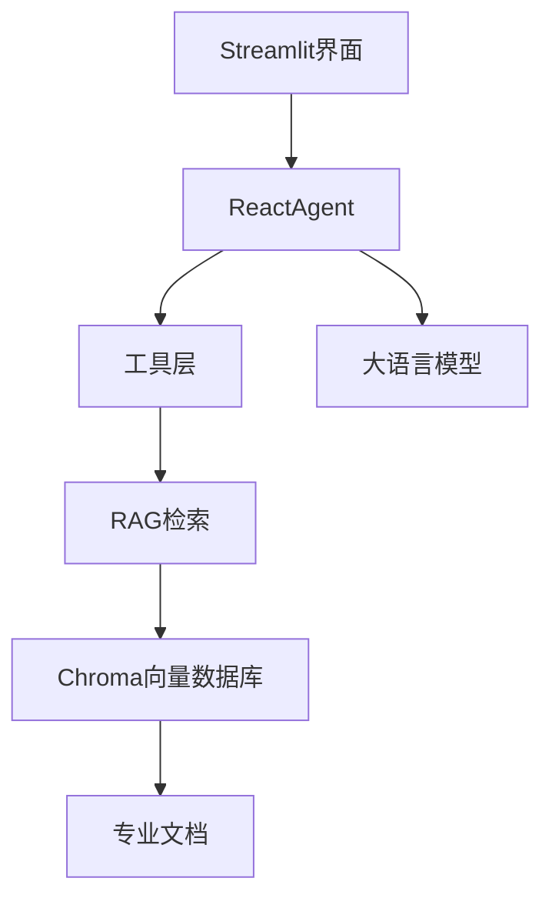

# 大疆无人机智能客服系统

基于 LangChain 构建的大疆无人机智能客服问答系统，支持专业知识检索和个性化报告生成。

## 功能特性

- **智能问答**：基于 RAG 技术，从专业文档中检索精准答案
- **个性化报告**：根据用户飞行记录生成专属使用报告
- **天气适配**：结合用户位置和天气条件给出飞行建议
- **流式输出**：自然流畅的对话体验
- **中间件机制**：支持日志记录、性能监控、动态提示词切换

## 技术架构



## 快速开始

### 环境要求

- Python 3.10+
- 阿里云 DashScope API Key

### 安装依赖

```bash
pip install -r requirements.txt
```

### 配置环境变量

```bash
export DASHSCOPE_API_KEY=your_api_key_here
```

### 运行应用

```bash
streamlit run app.py
```

访问 http://localhost:8501 即可使用。

## 项目结构

```
Agent项目/
├── Agent/                    # Agent核心模块
│   ├── react_agent.py        # Agent主类
│   └── tools/                # 工具定义
├── RAG/                     # RAG检索模块
│   ├── rag_service.py        # RAG服务
│   └── vector_store.py       # 向量存储
├── model/                   # 模型工厂
├── utils/                   # 工具函数
├── config/                  # 配置文件
├── prompts/                 # 提示词模板
└── app.py                   # 前端入口
```

## 核心模块

### Agent 层
- `ReactAgent`: 基于 ReAct 模式的智能决策引擎
- 支持多工具调用和上下文管理

### RAG 层
- 向量检索 + 文档总结
- 支持自定义提示词模板

### 工具系统
- **rag_summarize**: 专业知识检索
- **get_weather**: 天气查询
- **get_user_location**: 用户定位
- **get_user_id**: 用户识别
- **get_current_month**: 时间获取
- **fetch_external_data**: 飞行记录查询
- **fill_context_for_report**: 报告上下文注入

## 配置文件

### 模型配置 (config/rag.yml)
```yaml
chat_model_name: qwen3-max
embedding_model_name: text-embedding-v4
```

### 提示词配置 (config/prompt.yml)
```yaml
main_prompt_path: prompts/main_prompt.txt
rag_summarize_prompt_path: prompts/rag_summarize.txt
report_prompt_path: prompts/report_prompt.txt
```

## 使用示例

### 问答模式
```
用户：无人机电池如何保养？
客服：无人机电池保养建议包括...
```

### 报告生成模式
```
用户：生成我的使用报告
客服：正在为您生成报告...
      用户ID：1005
      月份：2025-06
      使用记录：...
      保养建议：...
```

## 文档目录

- `docs/architecture.md` - 项目架构文档
- `docs/dataflow.md` - 数据流文档
- `docs/tools_api.md` - 工具API文档

## License

MIT License
