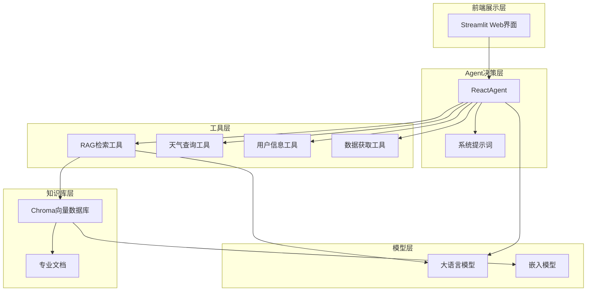
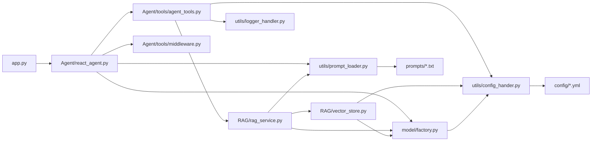

# 大疆无人机智能客服系统 - 项目架构文档

---

## 一、整体架构图



---

## 二、模块详细说明

### 2.1 前端展示层

| 组件 | 文件路径 | 功能说明 |
|------|----------|----------|
| Streamlit界面 | `app.py` | 用户交互入口，提供聊天界面 |

### 2.2 Agent决策层

| 组件 | 文件路径 | 功能说明 |
|------|----------|----------|
| ReactAgent | `Agent/react_agent.py` | 核心决策引擎，执行ReAct推理流程 |
| 系统提示词 | `prompts/main_prompt.txt` | 定义Agent的行为准则和工具使用说明 |

### 2.3 工具层

| 工具名称 | 文件路径 | 功能说明 |
|----------|----------|----------|
| rag_summarize | `Agent/tools/agent_tools.py` | 从向量数据库检索专业资料 |
| get_weather | `Agent/tools/agent_tools.py` | 获取指定城市天气信息 |
| get_user_location | `Agent/tools/agent_tools.py` | 获取用户所在城市 |
| get_user_id | `Agent/tools/agent_tools.py` | 获取用户唯一标识 |
| get_current_month | `Agent/tools/agent_tools.py` | 获取当前月份 |
| fetch_external_data | `Agent/tools/agent_tools.py` | 获取用户飞行记录 |
| fill_context_for_report | `Agent/tools/agent_tools.py` | 报告生成上下文注入 |
| monitor_tool | `Agent/tools/middleware.py` | 工具调用监控中间件 |
| log_before_model | `Agent/tools/middleware.py` | 模型调用日志中间件 |
| report_prompt_switch | `Agent/tools/middleware.py` | 报告提示词切换中间件 |

### 2.4 知识库层

| 组件 | 文件路径 | 功能说明 |
|------|----------|----------|
| VectorStoreService | `RAG/vector_store.py` | 向量数据库管理服务 |
| RagSummarizeService | `RAG/rag_service.py` | RAG检索与总结服务 |
| Chroma DB | `RAG/chroma_db/` | 向量数据库存储目录 |

### 2.5 模型层

| 组件 | 文件路径 | 功能说明 |
|------|----------|----------|
| ChatModelFactory | `model/factory.py` | 聊天模型工厂 |
| EmbeddingsModelFactory | `model/factory.py` | 嵌入模型工厂 |

### 2.6 工具层

| 组件 | 文件路径 | 功能说明 |
|------|----------|----------|
| config_hander | `utils/config_hander.py` | 配置文件加载器 |
| logger_handler | `utils/logger_handler.py` | 日志处理模块 |
| prompt_loader | `utils/prompt_loader.py` | 提示词加载器 |
| path_tool | `utils/path_tool.py` | 路径工具函数 |

---

## 三、目录结构

```plaintext
Agent项目/
├── Agent/                    # Agent核心模块
│   ├── react_agent.py        # Agent主类
│   ├── tools/               # 工具定义
│   │   ├── agent_tools.py   # 业务工具
│   │   └── middleware.py    # 中间件
│   └── chroma_db/           # 工具层向量数据库
├── RAG/                     # RAG检索模块
│   ├── rag_service.py       # RAG服务
│   ├── vector_store.py      # 向量存储
│   └── chroma_db/           # RAG层向量数据库
├── model/                   # 模型工厂
│   └── factory.py           # 模型创建工厂
├── utils/                   # 工具函数
│   ├── config_hander.py     # 配置管理
│   ├── logger_handler.py    # 日志管理
│   ├── prompt_loader.py     # 提示词加载
│   └── path_tool.py         # 路径工具
├── config/                  # 配置文件
│   ├── rag.yml              # RAG配置
│   ├── agent.yml            # Agent配置
│   ├── prompt.yml           # 提示词配置
│   └── chroma.yml           # 向量数据库配置
├── prompts/                 # 提示词模板
│   ├── main_prompt.txt      # 主提示词
│   ├── rag_summarize.txt    # RAG提示词
│   └── report_prompt.txt    # 报告提示词
├── logs/                    # 日志文件
├── 大疆相关/                # 原始文档
│   └── extermal/            # 外部数据
└── app.py                   # 前端入口
```

---

## 四、模块依赖关系


