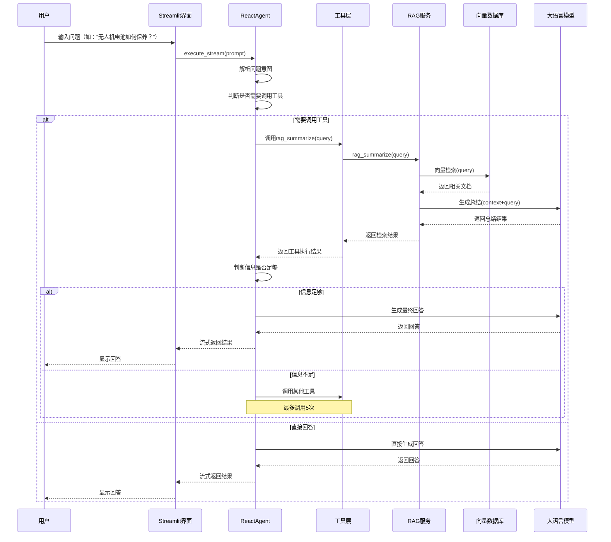
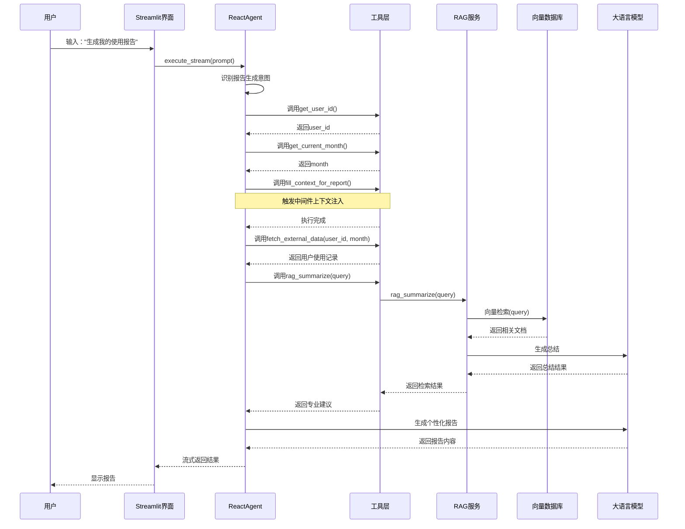
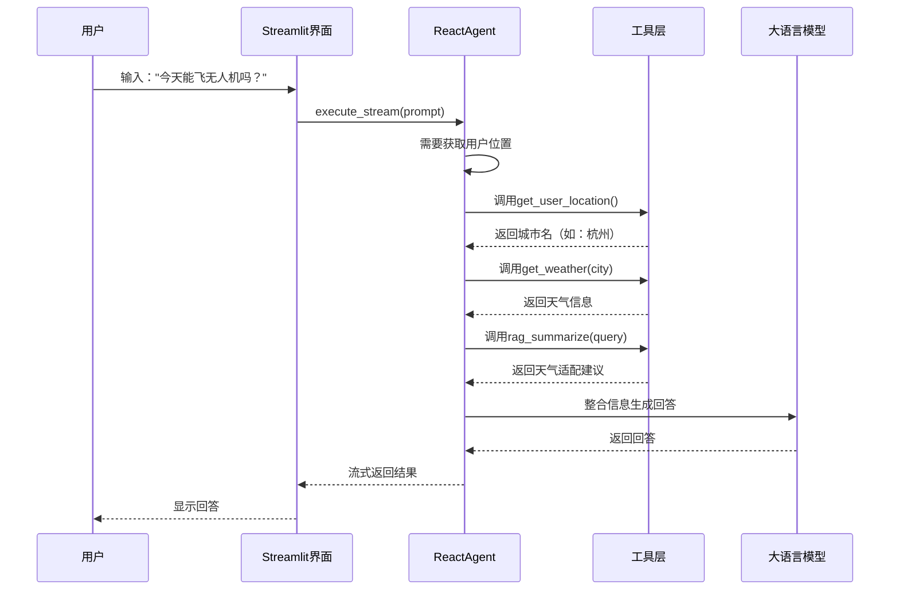
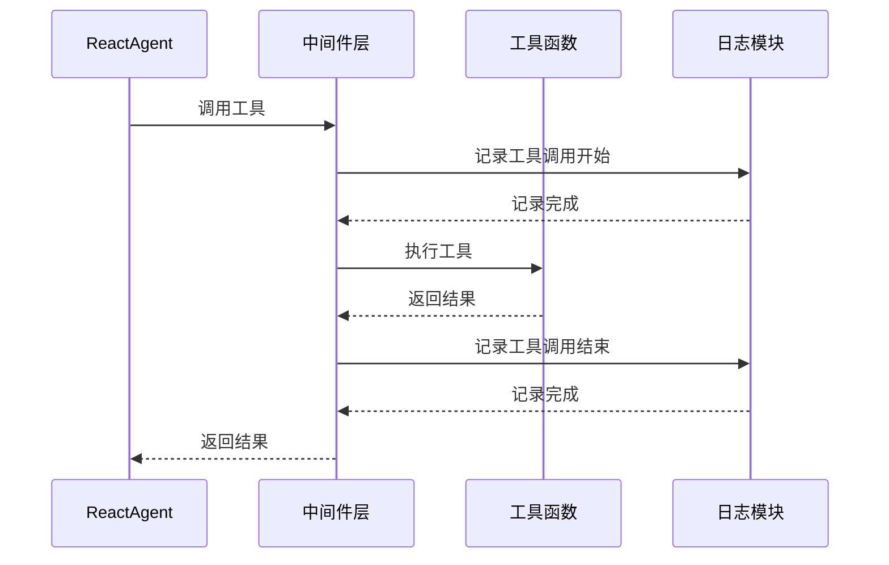
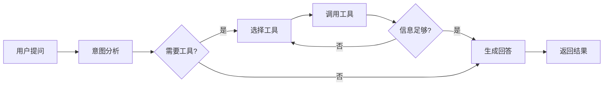
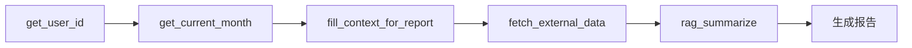

# 大疆无人机智能客服系统 - 数据流文档

---

## 一、智能问答流程

---

## 二、报告生成流程

---

## 三、天气查询流程

---

## 四、工具调用时序图

---

## 五、数据流程图总结

### 5.1 核心数据流

| 阶段 | 数据类型 | 说明 |
|------|----------|------|
| 用户输入 | 文本字符串 | 用户的自然语言问题 |
| 意图识别 | 结构化数据 | 解析后的用户意图 |
| 工具调用 | 字典参数 | 工具名称+入参 |
| 检索结果 | 文档列表 | 向量数据库返回的相关文档 |
| 模型输入 | 提示词+上下文 | 组合后的完整提示词 |
| 模型输出 | 文本字符串 | 大语言模型的回答 |

### 5.2 工具调用链

### 5.3 报告生成工具调用顺序

