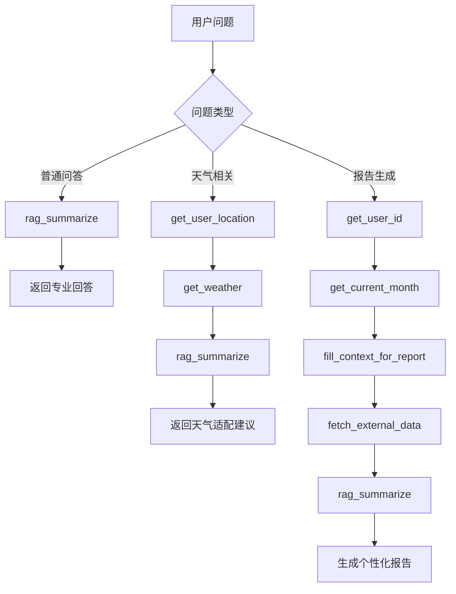
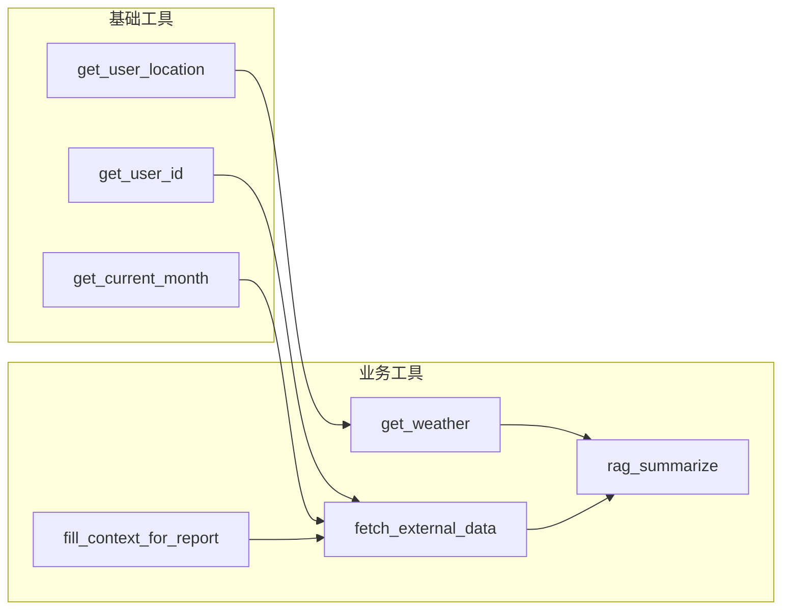

# 大疆无人机智能客服系统 - 工具API文档

---

## 一、工具概述

本系统共实现了 **7个核心工具**，涵盖知识检索、环境获取、用户信息、数据查询等功能。所有工具均使用 `@tool` 装饰器定义，集成到 LangChain Agent 框架中。

---

## 二、工具详细说明

### 2.1 rag_summarize - 专业知识检索

**功能描述**：从向量数据库中检索与用户问题相关的大疆无人机专业文档，并生成总结回答。

```python
@tool(description="从向量存储中检索参考资料")
def rag_summarize(query: str) -> str:
    """
    Args:
        query: 检索词，纯文本字符串
        
    Returns:
        str: 检索到的专业资料总结内容
    """
```

**使用场景**：
- 用户询问无人机使用问题
- 需要获取专业保养建议
- 故障排查相关问题
- 选购指南咨询

**输入输出示例**：
```python
# 输入
rag_summarize("无人机电池如何保养")

# 输出
"无人机电池保养建议包括：避免过度放电，长期存放时保持电量在40%-60%，避免高温或低温环境存储，使用原装充电器充电。"
```

---

### 2.2 get_weather - 天气查询

**功能描述**：获取指定城市的实时天气信息，包括温度、湿度、风力、AQI等。

```python
@tool(description="获取指定城市天气，以消息字符串形式返回")
def get_weather(city: str) -> str:
    """
    Args:
        city: 城市名称，纯文本字符串
        
    Returns:
        str: 包含天气信息的字符串
    """
```

**使用场景**：
- 用户询问当前天气是否适合飞行
- 需要结合天气条件给出保养建议
- 飞行前的环境评估

**输入输出示例**：
```python
# 输入
get_weather("杭州")

# 输出
"城市杭州天气为晴天，气温26摄氏度，空气湿度30%，南风2级，AQI21，最近12小时降雨概率低"
```

---

### 2.3 get_user_location - 用户定位

**功能描述**：获取当前用户所在的城市名称，用于后续天气查询等操作。

```python
@tool(description="获取用户所在城市名称，以字符串形式返回")
def get_user_location() -> str:
    """
    Args:
        无
        
    Returns:
        str: 用户所在城市名称
    """
```

**使用场景**：
- 需要根据用户位置获取天气信息
- 提供地域相关的保养建议
- 个性化服务需要

**输入输出示例**：
```python
# 输入
get_user_location()

# 输出
"杭州"
```

---

### 2.4 get_user_id - 用户ID获取

**功能描述**：获取当前用户的唯一标识，用于检索用户的飞行记录数据。

```python
@tool(description="获取用户的ID，以纯字符串形式返回")
def get_user_id() -> str:
    """
    Args:
        无
        
    Returns:
        str: 用户ID（数字字符串，如"1001"）
    """
```

**使用场景**：
- 生成用户个人使用报告
- 检索用户历史飞行记录
- 用户个性化服务

**输入输出示例**：
```python
# 输入
get_user_id()

# 输出
"1005"
```

---

### 2.5 get_current_month - 当前月份获取

**功能描述**：获取当前系统月份，格式为 YYYY-MM。

```python
@tool(description="获取当前月份，以纯字符串形式返回")
def get_current_month() -> str:
    """
    Args:
        无
        
    Returns:
        str: 当前月份（格式：YYYY-MM）
    """
```

**使用场景**：
- 生成月度使用报告
- 统计用户当月飞行数据
- 时间相关的数据分析

**输入输出示例**：
```python
# 输入
get_current_month()

# 输出
"2025-06"
```

---

### 2.6 fetch_external_data - 外部数据获取

**功能描述**：根据用户ID和月份，从外部数据源检索用户的飞行记录。

```python
@tool(description="从外部系统中获取指定用户的使用记录")
def fetch_external_data(user_id: str, month: str) -> str:
    """
    Args:
        user_id: 用户ID，数字字符串
        month: 月份，格式为YYYY-MM
        
    Returns:
        str: 用户使用记录（JSON格式字符串），检索不到返回空字符串
    """
```

**使用场景**：
- 生成用户个人使用报告
- 分析用户飞行习惯
- 提供个性化建议

**输入输出示例**：
```python
# 输入
fetch_external_data("1007", "2025-01")

# 输出
'{"应用场景": "婚礼跟拍", "电池情况": "电池寿命情况: 98%", "飞行时长": "可飞行时长50min", "天气情况": "天气：晴", "对比": "备注：全程平稳，无异常震动"}'
```

---

### 2.7 fill_context_for_report - 报告上下文注入

**功能描述**：无入参工具，调用后触发中间件自动为报告生成场景注入上下文信息，用于后续提示词切换。

```python
@tool(description="为报告生成提供场景动态和注入上下文动态信息")
def fill_context_for_report():
    """
    Args:
        无
        
    Returns:
        str: 固定返回 'fill_context_for_report()已调用'
    """
```

**使用场景**：
- **仅用于报告生成场景**
- 必须在 fetch_external_data 之前调用
- 触发报告提示词切换

**输入输出示例**：
```python
# 输入
fill_context_for_report()

# 输出
"fill_context_for_report()已调用"
```

---

## 三、工具调用流程图



---

## 四、工具能力矩阵

| 工具名称 | 入参需求 | 返回类型 | 主要用途 | 调用频率 |
|----------|----------|----------|----------|----------|
| rag_summarize | query: str | str | 知识检索 | 高 |
| get_weather | city: str | str | 天气查询 | 中 |
| get_user_location | 无 | str | 用户定位 | 中 |
| get_user_id | 无 | str | 用户识别 | 低（报告） |
| get_current_month | 无 | str | 时间获取 | 低（报告） |
| fetch_external_data | user_id, month | str | 数据查询 | 低（报告） |
| fill_context_for_report | 无 | str | 上下文注入 | 低（报告） |

---

## 五、工具依赖关系


